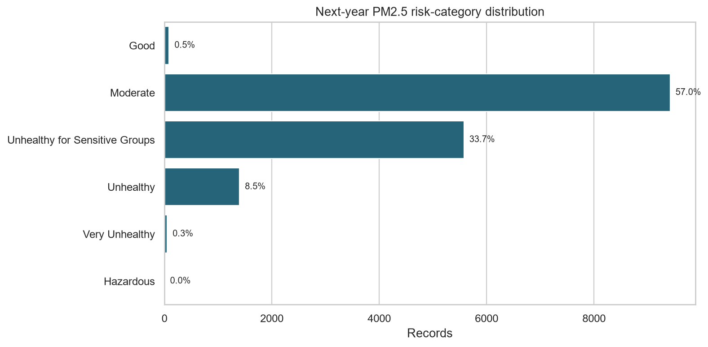
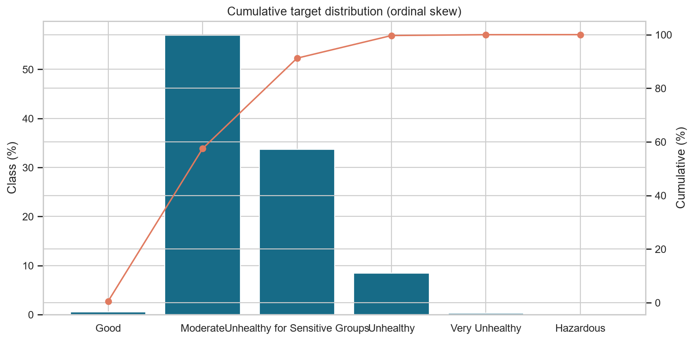
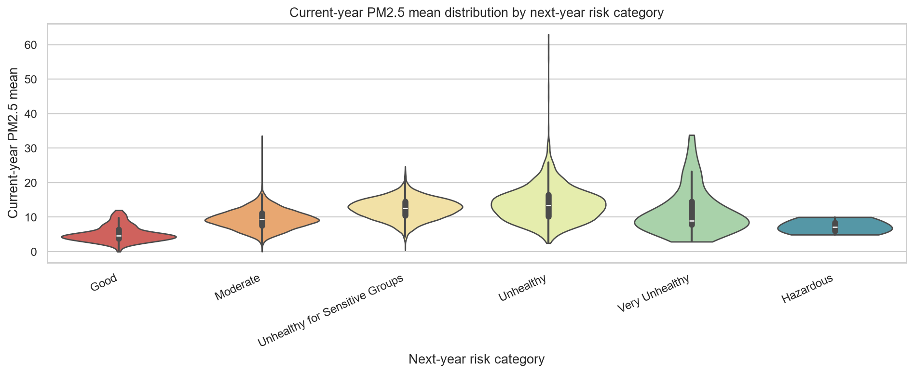
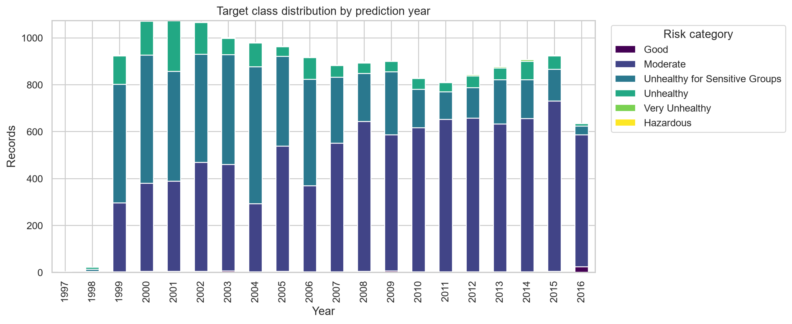
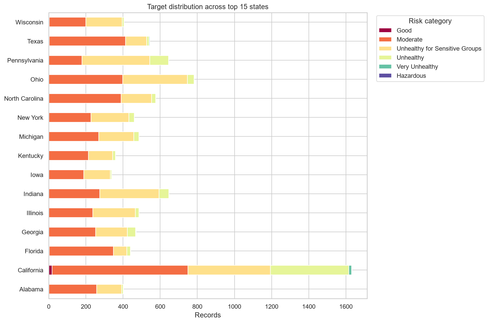
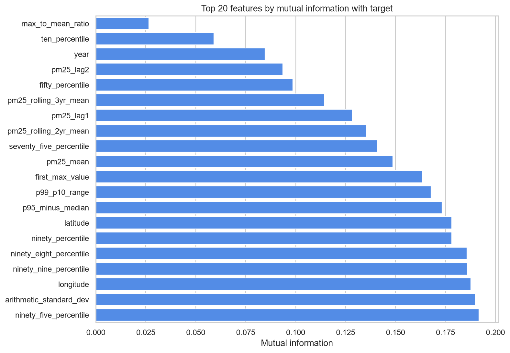
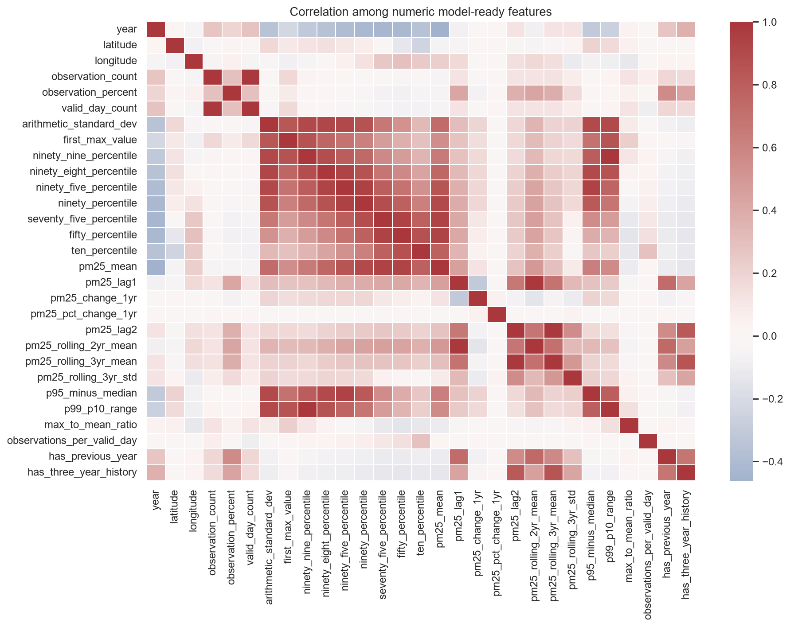
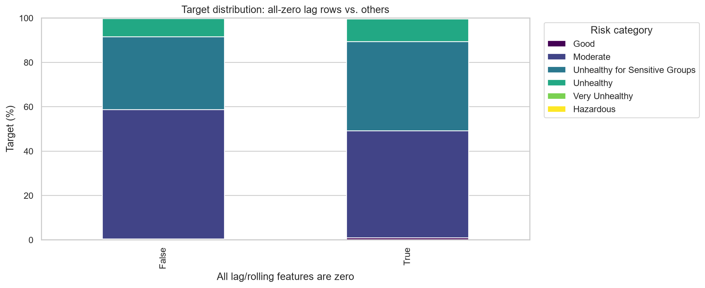

# Processed PM2.5 Dataset — Enhanced EDA Report

- **Source**: `data/interim/ml_ready_base.csv`
- **Rows**: 16,535
- **Columns**: 38
- **Monitoring sites**: 1849
- **Years**: 1997–2016

## 1. Target variable and class imbalance

- Target: `pm25_risk_category_next_year` (ordinal, 6 classes).
- Largest class: **Moderate** (9,418 records).
- Rarest non-empty class: **Hazardous** (4 records).
- **Imbalance ratio (max/min)**: 2354.50.
- Ordinal target → accuracy alone is misleading; use Quadratic Weighted
  Kappa (QWK), macro-F1, or MAE-in-class-order during Stage 6.
- Recommended handling: class weights, ordinal encoding, stratified CV.

See `target_distribution.csv` and `target_cumulative_distribution.png`.

## 2. Ordinal target diagnostics

- Distribution shape and separation shown in
  `pm25_mean_violin_by_target.png` and `pm25_mean_by_target.png`.
- Good separation between adjacent classes supports ordinal modelling.

## 3. Missing values and 'unknown' values

- Columns with any missing values: 0.
- Columns with literal `unknown` values: 4.
- Total `unknown` occurrences: 3186.
- Row-level unknown counts: `unknown_per_row.csv`.
- Numeric `unknown` values must be coerced and imputed **within the
  training split** to avoid leakage.

## 4. Duplicates

- Duplicate rows: 0
  (0.0%).
- Decision: drop exact duplicates during cleaning.

## 5. Outliers (IQR method)

- Per-feature IQR bounds and counts: `outliers_iqr.csv`.
- Air-quality extremes often reflect real events — treat with care.

## 6. Temporal analysis

- Target composition by year: `target_by_year.csv`, `target_by_year.png`.
- PM2.5 mean by year: `pm25_mean_by_year.png`.
- Distribution shifts over years justify **temporal splitting** to
  prevent temporal leakage.

## 7. Geographic analysis

- Target distribution across top 15 states: `target_by_state.csv`,
  `target_by_state.png`.
- Reveals geographic bias — informs stratified splitting decisions.

## 8. Feature usefulness (mutual information)

- 29 features ranked by mutual information with target.
- Top features: ninety_five_percentile, arithmetic_standard_dev, longitude, ninety_nine_percentile, ninety_eight_percentile
- Full ranking: `mutual_information.csv`, `mutual_information.png`.

## 9. Feature diagnostics

- Zero-variance features: 0.
- Zero-heavy features (>30% zeros): 0.
- Skewness, kurtosis and zero-percentage: `feature_diagnostics.csv`.
- Heavy skew → consider log/power transforms for linear models.

## 10. Zero-encoding vs target

- Rows whose lag/rolling features are all zero may have systematically
  different target distributions — verified in `zero_lag_vs_target.csv`.
- If differences exist, add explicit missingness flags during modelling.

## 11. Correlation and multicollinearity

- Correlation matrix: `correlation_matrix.csv`.
- Heatmap: `feature_correlation.png`.
- Strong pairs (|r| > 0.8): `strong_correlations.csv`.
- Highly correlated features must be handled during feature selection.

## 12. Data-leakage verification

- Leakage candidates / risks found: 0.
- Details: `leakage_check.csv`.
- Target must never appear as a predictor.
- Rolling windows must not overlap with the target year.

## 13. Train/test distribution shift check

- Compare `train_test_shift.csv` to confirm stratified split stability.
- If features shift, adjust split strategy in Stage 4.

## 14. Key observations informing preprocessing

1. Drop exact duplicates.
2. Coerce `unknown` → NaN, then impute within training split only.
3. Handle ordinal target with class weights or ordinal encoding.
4. Use stratified (or temporal) train/test split.
5. Drop zero-variance features.
6. Add missingness flags for zero-heavy lag features.
7. Inspect strong correlations before feature selection.
8. Verify absence of leakage before modelling.
9. Use QWK, macro-F1, or ordinal MAE as primary metrics.

## Figures

