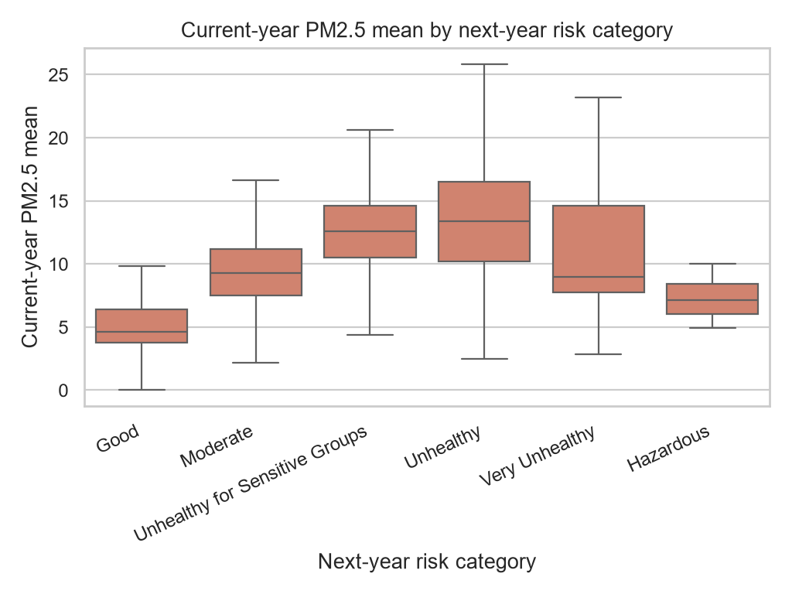
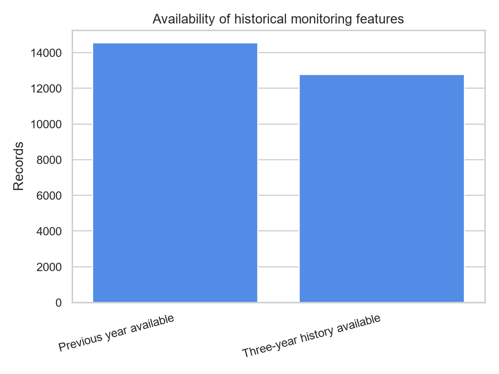

# Processed PM2.5 Dataset EDA

- Source: `data/interim/ml_ready_base.csv`
- Rows: **16,535**
- Columns: **38**
- Monitoring sites: **1,849**
- Prediction years: **1997–2016**

## Key observations

- The largest target class is **Moderate** with 9,418 records (57.0%).
- The rarest non-empty target class is **Hazardous** with 4 records (0.02%).
- `pm25_mean` has a median of **10.53** and a maximum of **63.00**.
- Previous-year history is available for 87.9% of rows; three-year history is available for 77.2%.

## Data-quality and modeling signals

Unavailable lag and rolling values are encoded as zero, while the history indicator columns preserve whether prior observations existed.
There are **54** literal `unknown` values and 2 affected columns: ten_percentile, p99_p10_range.
Numeric `unknown` values must be converted and imputed within the training split before modeling.
The target is complete and should not be included as a predictor. Identifier and location text columns are retained for analysis but require encoding or exclusion before model fitting.
Complete missingness and numeric summaries are available in `missing_values.csv` and `numeric_summary.csv`.

## Figures

