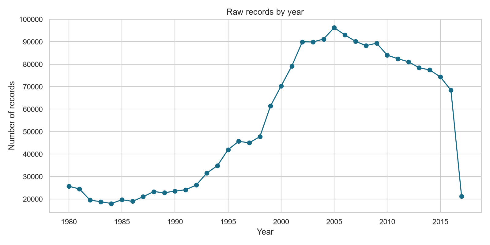
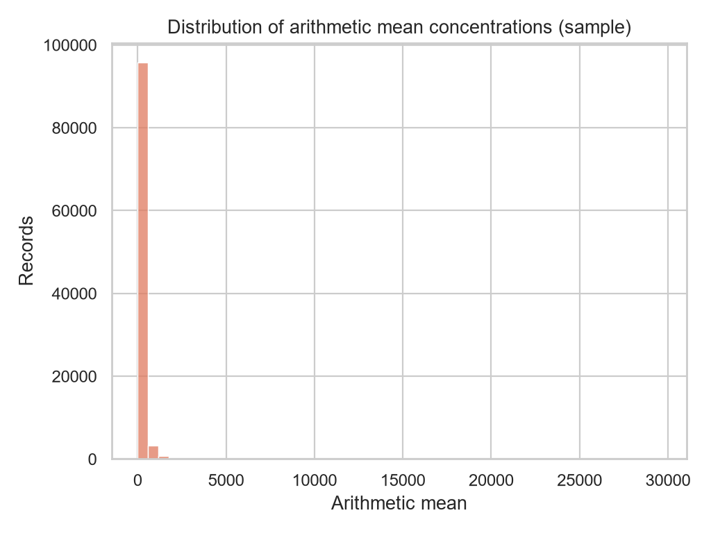
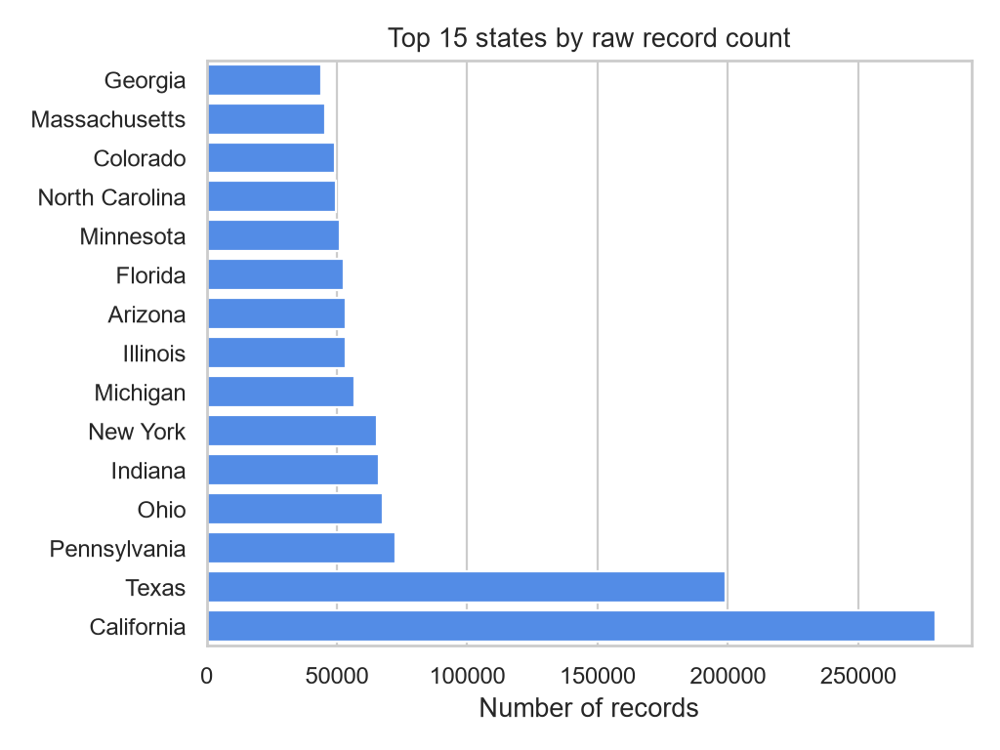

# Raw EPA Air-Quality EDA

- Source: `data/raw/epa_air_quality_annual_summary.csv`
- Rows: **2,038,710**
- Columns: **55**
- Numeric summaries use all raw chunks; the concentration histogram uses the first 100,000 rows.

## Key observations

- The dataset spans years 1980 to 2017.
- The most frequent parameter is **Ozone**.
- The most represented state is **California**.
- `arithmetic_mean` has 24 non-numeric or missing values after coercion.

## Data-quality signals

The complete missing-value table is in `missing_values.csv`; numeric statistics are in `numeric_summary.csv`.
Raw records contain multiple pollutants, units, durations, and monitoring years. PM2.5-specific filtering should therefore remain in the cleaning stage before modeling.

## Figures

